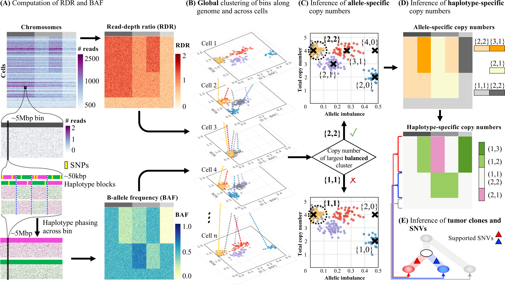

# CHISEL <br/> <sub><u>C</u>opy-number <u>H</u>aplotype <u>I</u>nference in <u>S</u>ingle-cell by <u>E</u>volutionary <u>L</u>inks</sub> #

CHISEL is an algorithm to infer allele- and haplotype-specififc copy numbers in individual cells from low-coverage single-cell DNA sequencing data.
Specifically, the current implementation of CHISEL has been designed to be diretly applied to ultra-low coverage single-cell DNA sequencing data from 10X Genomics CNV solution, however CHISEL will be adapted to the data generated by any other available technology (e.g. DLP+).
The full description of the algorithm and its application on published cancer datasets are described in

[Simone Zaccaria and Ben Raphael, 2019](https://doi.org/10.1101/837195)

The results of CHISEL on the published low-coverage single-cell DNA sequencing data of cancer patients and all the related analyses are available at

[CHISEL data](https://github.com/raphael-group/chisel-data)

This repository includes detailed instructions for installation and requirements, demos with related tutorial of different CHISEL applitcations, a list of current issues, and contacts.
The CHISEL repository is currently in a preliminary release and improved versions are released frequently.
During this stage, please remember to often update your version by pulling the last release of CHISEL.

## Contents ##

1. [Overview](#overview)
    - [Algorithm](#algorithm)
    - [Software](#software)
2. [Setup](#setup)
    - [Dependencies](#dependencies)
    - [Conda installation](#conda)
    - [Virtualenv installation](#virtualenv)
3. [Usage](#usage)
    - [Required data](#requireddata)
    - [Commands](#commands)
    - [Demos](#demos)
    - [Reccomendations and quality control](#reccomendations)
4. [Development](#development)
    - [Recent and important updates](#updates)
    - [Current issues](#currentissues)
5. [Contacts](#contacts)

## Overview
<a name="overview"></a>

### Algorithm
<a name="algorithm"></a>



**The CHISEL algorithm.** **(A)** CHISEL computes RDRs and BAFs in low-coverage (<0.05X per cell) single-cell DNA sequencing data (top left). Read counts from 2000 individual cells (rows) in 5Mb genomic bins (columns) across three chromosomes (grey rectangles in first row) are shown. For each bin in each cell, CHISEL computes the RDR (top) by normalizing the observed read counts. CHISEL computes the BAF in each bin and cell (bottom) by first performing referenced-based phasing of germline SNPs in 50kb haplotype blocks (magenta and green) and then phasing all these blocks jointly across all cells. **(B)** CHISEL clusters RDRs and BAFs globally along the genome and jointly across all cells resulting here in 5 clusters of genomic bins (red, blue, purple, yellow, and grey) with distinct copy-number states. **(C)** CHISEL infers a pair of allele-specific copy numbers for each cluster by determining whether the allele-specific copy numbers of the largest balanced (BAF~0.5) cluster are equal to *{1, 1}* (diploid), *{2, 2}* (tetraploid), or are higher ploidy. **(D)** CHISEL infers haplotype-specific copy numbers *(a, b)* by phasing the allele-specific copy numbers consistently across all cells. **(E)** CHISEL clusters tumor cells into clones according to their haplotype-specific copy numbers. Here, a diploid clone (light gray) and two tumor clones (red and blue) are obtained. A phylogenetic tree describes the evolution of these clones. Somatic single-nucleotide variants (SNVs) are derived from pseudo-bulk samples and placed on the branches of the tree.

### Software
<a name="software"></a>

The current software implementation provides different commands within `bin` to atuomatically execute the different features/pipelines of CHISEL. See details in [Usage](#usage). CHISEL is mostly written in `python` and provides convenient automatic installation procedures within independent virtual enviroments.

## Setup
<a name="setup"></a>

CHISEL is written in python 2.7, is based on standard python packages, and does not required any compilation but only two additional standard open-source softwares.
To support CHISEL distribution, we report two automatic and easy installation processes for CHISEL and all the requirements, through package managers which keep everything up to date.
The usage of package managers is the recommended installation process.
The details are reported in the following sections:
1. [Dependencies](#dependencies): required packages and additional software;
2. [Conda installation](#conda): automatic installation through package manager conda;
3. [Virtualenv installation](#virtualenv): automatic installation through python virtual environments;
3. [Additional notes](#additionalnotes): additional and useful notes for possible issues and reccomendations.

### Dependencies
<a name="dependencies"></a>

CHISEL requires few standard python packages and two additional standard softwares.
These requirements can be either manually installed by the user or automatically installed through the automatic installation processes (see below).

#### > Python packages

CHISEL depends on the following standard python packages, which must be available in the python environment where the user runs CHISEL.

| Package | Tested version | Comments |
|---------|----------------|----------|
| [numpy](https://numpy.org/) | 1.16.1 | Efficient scientific computations |
| [scipy](https://www.scipy.org/) | 1.2.1 | Efficient mathematical functions and methods |
| [pandas](https://pandas.pydata.org/) | 0.20.1 | Dataframe management |
| [matplotlib](https://matplotlib.org/) | 2.0.2 | Basic plotting utilities |
| [seaborn](https://seaborn.pydata.org/) | 0.7.1 | Advanced plotting utilities |

#### > Additional software

CHISEL also requires few standard additional softwares, which can be easily and locally installed following the corresponding instructions (see links).

| Software | Tested version | Comments |
|----------|----------------|----------|
| [AWK](https://en.wikipedia.org/wiki/AWK) | GNU Awk 4.0.2 | Scripting language available by default on most Unix-like OSs and with specific implementation available for any other OS |
| [SAMtools and BCFtools](http://www.htslib.org/doc/)  | 1.9 | Suite of programs for interacting with high-throughput sequencing data |

### Conda installation
<a name="conda"></a>

Conda provides one of the most common package and virtual-environment manager for python.
If conda is not available in your system, you can easily obtain it by installing one of the two most-common distributions (NO administration access is required for the installation): [anaconda](https://www.anaconda.com/) or [miniconda](https://docs.conda.io/en/latest/miniconda.html).
Once conda is installed in a directory `${CONDA-HOME}`, the following few commands represent an easy **one-time** process to install CHISEL in the home directory `${CHISEL-HOME}`.

```shell
$ git clone https://github.com/raphael-group/chisel ${CHISEL-HOME}/  # Clone the git repository into a specific directory `${CHISEL-HOME}`
$ ${CONDA-HOME}/bin/conda create -n chisel -c bioconda -c anaconda -n chisel python=2.7 numpy=1.12 scipy=1.2.1 pandas=0.20.1 matplotlib=2.0.2 seaborn=0.7.1 samtools=1.9 bcftools=1.9 gawk # Install required packages within environment # Create a CHISEL-specific virtual environment with required packages
$ source ${CONDA-HOME}/bin/activate chisel # Activate the CHISEL-specific virtual environment
```

User needs to activate the environment **anytime** before using any CHISEL command with the following:
```shell
$ source ${CONDA-HOME}/bin/activate chisel # Activate the CHISEL-specific virtual environment
```

Once any CHISEL usage is completed, user can exit the environment with the following:
```shell
$ source deactivate
```

### Virtualenv installation
<a name="virtualenv"></a>

Virtualenv is a python-integrated tool to create and manage python virtual environments; the virtuality is useful to keep each environment isolated from those of your OS and other environments, keeping packages with independent and correct versions without conflicts.
If virtualenv is not already available on your system, user can easily install it following the instructions either [here](https://virtualenv.pypa.io/en/latest/) or [here](https://packaging.python.org/guides/installing-using-pip-and-virtual-environments/).
The following few commands represent an easy **one-time** process to install CHISEL in the home directory `${CHISEL-HOME}`.

```shell
$ git clone https://github.com/raphael-group/chisel ${CHISEL-HOME}/  # Clone the git repository into a specific directory `${CHISEL-HOME}`
$ virtualenv ${CHISEL-HOME}/env   # Create a CHISEL-specific virtual environment
$ source ${CHISEL-HOME}/env/bin/activate  # Activate the CHISEL-specific virtual environment
$ pip install numpy==1.16.1 scipy==1.2.1 pandas==0.20.1 matplotlib==2.0.2 seaborn==0.7.1 # Install required packages within environment
$ deactivate
```

User needs to activate the environment **anytime** before using any CHISEL command with the following:
```shell
$ source ${PATH-TO-ENV}/chisel/bin/activate
```
Note that user also needs to add SAMtools and BCFtools to PATH (see additional notes below).

Once any CHISEL usage is completed, user can exit the environment with the following:
```shell
$ deactivate
```

### Additional notes:
<a name="additionalnotes"></a>

- To be able to run every CHISEL command without the need of specifying the prefix `${CHISEL-HOME}/bin/` at every use, simply add it to `$PATH` with the following command
```shell
export PATH=${PATH}:${CHISEL-HOME}/bin/
```

- Substitute the directory variables `${CHISEL-HOME}` and `${PATH-TO-ENV}/chisel` with the corresponding preferred paths. Alternatively, the user can define the environmental variables before any use as follows:
```shell
$ export CHISEL-HOME=/path/to/chisel/
$ export PATH-TO-ENV=/path/to/environments/
```

- The default installations of SAMtools and BCFtools (and awk in case this is not available by default) typically include the binaries in `${PATH}` such that they can be executed directly by calling `samtools` or `bcftools`. If this is not the case, user needs to provide the corresponding full paths to CHISEL commands when requested or can add the paths to `${PATH}` manually as follows:
```shell
$ export PATH=${PATH}:/path/to/samtools/bin/
$ export PATH=${PATH}:/path/to/bcftools/bin/
```

- When using Windows OS please follows the corresponding commands described either [here](https://virtualenv.pypa.io/en/latest/) or [here](https://packaging.python.org/guides/installing-using-pip-and-virtual-environments/).

- The same procedure can be applied using directly the OS python environment by only using the `pip` command to install the required packages and adding `--force-reinstall` to force reinstallation of packages when a different version is already installed.

## Usage
<a name="usage"></a>

### Required data
<a name="requireddata"></a>

CHISEL requires 4 input data:

1. A **single-cell barcoded BAM** file containing aligned DNA sequencing reads from single cells of a single patient. The BAM file needs to be indexed and sorted (see [SAMtools](http://www.htslib.org/workflow/#mapping_to_variant) and [GATK Best Practices](https://software.broadinstitute.org/gatk/best-practices/)). Current CHISEL implementation requires the barcoded BAM files to be in the 10X Genomics [format](https://support.10xgenomics.com/single-cell-dna/software/pipelines/latest/what-is-cell-ranger-dna) as produced by Cell Ranger DNA pipeline (especially barcodes are reported in [`CB` field](https://support.10xgenomics.com/single-cell-dna/software/pipelines/latest/output/bam)). Other common formats will be integrated for available data or upon request.

2. The **reference human genome** used to aligned the sequencing reads in the single-cell barcoded BAM. The most-used human reference genome are available at [GRC](https://www.ncbi.nlm.nih.gov/grc/human) or [UCSC](http://hgdownload.cse.ucsc.edu/downloads.html#human).

3. A **matched-normal BAM** file containing sequencing reads from a matched-normal sample from the same patient. When this sample is not available, user can use the corresponding CHISEL command `chisel-pseudonormal.py` to form a **pseudo** matched-normal sample by extracting diploid normal cells. Note that this approach is successfull only when normal diploid cells are present in the barcoded BAM file.

4. A **VCF file with phased germline SNPs** present in the matched-normal sample. CHISEL only requires a VCF with the phase `0|1` or `1|0` within the record of heterozygous phased SNPs and any reference-based phasing method can be used. Here, we recommend a very easy two step procedure: (1) use BCFtools to call germline SNPs from the matched-normal sample (as described [here](http://samtools.github.io/bcftools/howtos/variant-calling.html)); (2) use Eagle2 through the [Michigan Imputation Server](https://imputationserver.sph.umich.edu/index.html#!pages/home) to phase germline SNPs with respect to the reference panel HRC. Alternatively, Eagle2 can be used [locally](https://data.broadinstitute.org/alkesgroup/Eagle/), and other methods as [SHAPEIT](http://mathgen.stats.ox.ac.uk/genetics_software/shapeit/shapeit.html) or other panels as 1000 Genomes Phase 3 can be applied, too. Note that HRC currently supports only reference `hg19`, therefore user can use [LiftoverVcf from Picard tools](http://broadinstitute.github.io/picard/) or similar methods to convert genomic coordinates to the required `hg19` build, when a different reference genome has been used to align sequencing reads.

### Commands
<a name="commands"></a>

CHISEL offers different commands to run either the entire pipeline with all the steps or only some specific steps. In particular, the latter commands are useful when user wants to re-run some specific steps by varying some of the default parameters or for quality control (see below).
Every command can be easily run as follows (note that prefix `${CHISEL-HOME}/bin/` is not needed if used used conda installation or added the prefix to `PATH` as suggested above)
```shell
python2.7 ${CHISEL-HOME}/bin/<command>
```
where `${CHISEL-HOME}` is the CHISEL home directory and `<command>` is one of the available commands listed here below.

| Command | Description | Required input | Output |
|---------|-------------|----------------|--------|
| [`chisel.py`](man/chisel.md) | Running the complete CHISEL pipeline | The 4 required input data | [Final results and plots](doc/chisel.md) |
| [`chisel-calling.py`](man/chisel-calling.md) | Running from the inference of copy numbers | Computed RDRs and BAFs | [Final results and plots](doc/chisel-calling.md) |
| [`chisel-cloning.py`](man/chisel-cloning.md) | Running from the identification of clones | Inferred copy numbers | [Final results and plots](doc/chisel-cloning.md) |
| [`chisel-plotting.py`](man/chisel-plotting.md) | Running plot generation | Inferred copy numbers and clones | [Final plots](doc/chisel-plotting.md) |
| [`chisel-pseudonormal.py`](man/chisel-pseudonormal.md) | Extracting diploid cells to form a pseudo matched-normal sample | A barcoded BAM file containing diploid cells and the corresponding reference genome | [A BAM file to be used as a matched-normal sample](doc/chisel-pseudonormal.md) |

Click on the name of each command to obtain a description of all the available parameters.

### Demos
<a name="demos"></a>

Each demo is an exemplary and guided execution of a CHISEL command on available data. The demos are meant to illustrate the complete CHISEL pipeline and the usage of each specific command. In particular, the specific commands allow the user to explore the results when varying the main parameters (without the need to re-execute the entire pipeline), allowing to deal with different features of distinct datasets and to obtain the best-quality results (see recommendations below). Each demo is simultaneously a guided description of the entire example and a BASH script which can be directly executed to run the complete demo. As such, the user can both read the guided description as a web page and run the same script to execute the demo. At this time the following demos are available (more demos will be available soon):

| Demo | Description |
|------|-------------|
| [completeE](demos/completeE/demo-completeE.sh) | Demo of the complete CHISEL pipeline on tumor section E of breast cancer patient S0 |
| [callingE](demos/callingE/demo-callingE.sh) | Demo of `chisel-calling.py` command to re-run pipeline from the inference of copy numbers on tumor section E of breast cancer patient S0 |
| [cloningE](demos/cloningE/demo-cloningE.sh) | Demo of `chisel-cloning.py` command to re-run pipeline from the identification of clones on tumor section E of breast cancer patient S0 |
| [plottingE](demos/plottingE/demo-plottingE.sh) | Demo of `chisel-plotting.py` command to re-run plot generation on tumor section E of breast cancer patient S0 |
| [pseudonormal](demos/pseudonormal/demo-pseudonormal.sh) | Demo of `chisel-pseudonormal.py` command to generate a pseudo matched-normal sample by extracting diploid cells from a barcoded BAM file |

### Reccomendations and quality control
<a name="reccomendations"></a>

The following recommendations guide the user in the process of quality control for the final results. In order to deal with datasets with different features, these recommendations help the user in investigating solutions obtained with different parameters. In particular, some of these guides are especially helpful when analyzing datasets with non-standard features and with noisy or high-variance sequencing data, e.g. due to low number of cells, different sequencing coverages, low number of phased germline SNPs.

| Recommendation | Description |
|----------------|-------------|
| [Ploidy selection](guides/ploidy.md) | Adjusting model-selection parameters to accurately infer ploidy in noisy and high-variance datasets |
| [Identification of clones](guides/clones.md) | Interpreting the identified clones and explore alternative solutions |
| [Global clustering](guides/clustering.md) | Interpreting the global clustering of RDRs and BAFs, and exploring alternative solutions |

## Development
<a name="development"></a>

### Recent and important updates
<a name="updates"></a>

- **[22-Jan-2020]** This version introduced two important updates:
    1. CHISEL now use the inferred clones to correct the inferred allele- and haplotype-specific copy numbers, removing noise and outlying errors. As such, CHISEL generates plots with both uncorrected and corrected copy numbers;
    2. CHISEL now has a **sensitivity**, which can be varied through the command `chisel-cloning.py` to enable the accurate inference of cell ploidy even in the case of noisy or high-variance data (e.g. low number of cells with low coverage).
- **[20-Jan-2020]** This version introduced the previously missing command `chisel-pseudonormal.py`. This command can be used to extract sequencing reads from diploid cells to form a pseudo matched-normal sample, which is required by the full CHISEL pipeline. A corresponding demo has also been introduced.

### Current issues
<a name="currentissues"></a>

CHISEL is in active development, please report any issue or question as this could help the development and improvement of CHISEL. Known issues with current version are reported here below.

## Contacts
<a name="contacts"></a>

CHISEL's repository is actively maintained by [Simone Zaccaria](https://simozacca.github.io/), currently a Postodoctoral Research Associate at Princeton University in the research group of prof. Ben Raphael.
